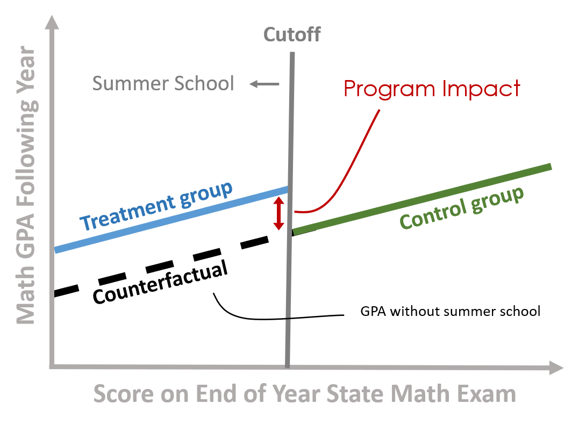

<!--- 
Submit Button - <a class="uk-button uk-button-primary" href="{{page.canvas.assignment_url}}">SUBMIT LAB</a>
-->


<div class = "uk-container uk-container-small">
  
<br><br>
<br><br>


## Week 1 - Interrupted Time Series 

* [LECTURE](https://ds4ps.org/pe4ps-textbook/docs/p-020-time-series.html)
* [LAB](https://ds4ps.org/pe4ps-textbook/labs/time-series-lab.html)

**DUE: MONDAY March 23rd**

<a class="uk-button uk-button-default" href="{{page.canvas.assignment_url}}">SUBMIT LAB</a>

<br> 

**Resources:**

Bernal, J. L., Cummins, S., & Gasparrini, A. (2017). Interrupted time series regression for the evaluation of public health interventions: a tutorial. International journal of epidemiology, 46(1), 348-355. [[PDF](http://www.ag-myresearch.com/uploads/1/3/8/6/13864925/2016_lopezbernal_ije.pdf)]

Chapter on Interrrupted Time Series [[PDF](https://github.com/DS4PS/cpp-525-spr-2020/raw/master/pubs/cook-campbell-shadish-interrupted-time-series.pdf)]:  From Shadish, W. R., Cook, T. D., & Campbell, D. T. (2002). *Experimental and quasi-experimental designs for generalized causal inference.* Boston: Houghton Mifflin.


<br>


<br>


```r
# Interrupted Time Series Model 
Y = b0 + (b1)(T) + (b2)(D) + (b3)(P) + e

# b1 = pre-intervention trend 
# b2 = discrete change after intervention 
# b3 = sustained change to the slope after intervention
```

<br>

----

<br>


## Week 2 - Difference-in-Difference Models 

* [LECTURE](https://ds4ps.org/pe4ps-textbook/docs/p-030-diff-in-diff.html)
* [overview video](https://asu.zoom.us/rec/play/tMIrd7yvqDo3TNfD4gSDV_V5W425e_6s2yBNrqBcxUixASFRY1GmN7VDNuqKJy2LLzjKb6H4yI5HWMZw?continueMode=true&_x_zm_rtaid=a3eEFLG8Qtiy1qBhz5Gnyg.1586645508130.02d1fbabc21b564365fde85fb34937b4&_x_zm_rhtaid=598)
* [LAB](https://ds4ps.org/pe4ps-textbook/labs/diff-in-diff-lab.html)

Due MON Mar 30th

<a class="uk-button uk-button-default" href="{{page.canvas.assignment_url}}">SUBMIT LAB</a>

<br>

**Review:** 

Hypothesis testing with dummy variables: [lecture notes](https://github.com/DS4PS/cpp-523-spr-2020/raw/master/lectures/hypotheses-tests-with-dummy-variables.pdf)   

Varieties of the counterfactual: [lecture notes](https://github.com/DS4PS/cpp-524-spr-2020/raw/master/lectures/p-03-varieties-of-counterfactuals.pdf)   

**Reference:**

Wing, C., Simon, K., & Bello-Gomez, R. A. (2018). Designing difference in difference studies: best practices for public health policy research. Annual review of public health, 39. [[pdf](https://www.annualreviews.org/doi/pdf/10.1146/annurev-publhealth-040617-013507)] 

<br>

----

<br>


## Week 3 - Panel Data with Fixed Effects 

* [LECTURE NOTES](https://github.com/DS4PS/cpp-525-spr-2020/raw/master/lectures/p-23-fixed-effects.pdf)
* [LECTURE CHAPTER](https://ds4ps.org/pe4ps-textbook/docs/p-040-fixed-effects.html)
* [overview video](https://asu.zoom.us/rec/play/vZQrcbj9qTo3T9aSuQSDC6dxW9S7Kais0SVP-qUKykm9B3QGMFahYeMVZLENnE0QqLfC7HHfx_JInrRR?continueMode=true&_x_zm_rtaid=a3eEFLG8Qtiy1qBhz5Gnyg.1586645508130.02d1fbabc21b564365fde85fb34937b4&_x_zm_rhtaid=598)
* [LAB](https://ds4ps.org/pe4ps-textbook/labs/fixed-effects-lab.html)

Due MON Apr 6th

<a class="uk-button uk-button-default" href="{{page.canvas.assignment_url}}">SUBMIT LAB</a>

<br>

----

[useful notes on interpretting output](https://www.princeton.edu/~otorres/Panel101.pdf)

[random effects example](https://raw.githubusercontent.com/DS4PS/cpp-525-spr-2020/master/lectures/random-effects.R)


Group-level variable is correlated with the outcome, but uncorrelated with the policy variable. Thus omission does not cause bias, but inclusion increases efficiency. 

Recall the [taxonomy of control variables](https://github.com/DS4PS/cpp-523-spr-2020/raw/master/lectures/taxonomy-of-control-variables.pdf).

Random effects are Type A controls. Fixed effects are Type B controls:


<br>
<hr>
<br>


<br>
<br>

<hr>

<br>
<br>


## Week 4 - Instrumental Variables 

* [LECTURE NOTES](https://github.com/DS4PS/cpp-525-spr-2020/raw/master/lectures/p-24-instrumental-variables.pdf)
* [LECTURE CHAPTER](https://ds4ps.org/pe4ps-textbook/docs/p-050-instrumental-variables.html)
* [LAB](https://ds4ps.org/pe4ps-textbook/labs/instrumental-variables.html)
<br>

* [iv regression example](https://ds4ps.org/cpp-525-spr-2020/lectures/p-25-iv-example.html)
* [overview of iv regression (video)](https://asu.zoom.us/rec/play/u5x-I7r9-Dw3GYLH4gSDB_5xW9TpK6qs0HQY-qIJmEazVHQBNwCvNLETM-KIqBwzOPr2gZymGDn8qDSn?continueMode=true&_x_zm_rtaid=a3eEFLG8Qtiy1qBhz5Gnyg.1586645508130.02d1fbabc21b564365fde85fb34937b4&_x_zm_rhtaid=598)


Due MON Apr 13th

<a class="uk-button uk-button-default" href="{{page.canvas.assignment_url}}">SUBMIT LAB</a>

<br>
<br>

<hr>

<br>
<br>


## Week 5 - Regression Discontinuity Design 

* [LECTURE](https://ds4ps.org/pe4ps-textbook/docs/p-060-reg-discontinuity.html)
* [LAB](https://ds4ps.org/pe4ps-textbook/labs/regression-discontinuity-lab.html)

Due MON Apr 20th

<a class="uk-button uk-button-default" href="{{page.canvas.assignment_url}}">SUBMIT LAB</a>

<br>

----

<br>


<br>
<br>

----

<br>


## Week 6 - Logistic Regression 

* [LECTURE](https://ds4ps.org/pe4ps-textbook/docs/p-070-logistic-regression.html)
* [LAB](https://ds4ps.org/pe4ps-textbook/labs/logit-lab.html)

* [example script](examples/logistic-regression-example.R)  
* [video](https://asu.zoom.us/rec/share/xfMlBJHy_E5IZ7fGsnvxB5UzGKTreaa8hiAWqfIPnhtzDDh-1wytiZ5OYSgLp0WQ)  

Due MON Apr 27th

<a class="uk-button uk-button-default" href="{{page.canvas.assignment_url}}">SUBMIT LAB</a>

<br>

----

<br>


## Week 7 - Propensity Score Matching 

* [LECTURE](https://ds4ps.org/pe4ps-textbook/docs/p-080-matching.html)
* [LAB](https://ds4ps.org/pe4ps-textbook/labs/matching-lab.html)

[video overview](https://asu.zoom.us/rec/share/4MpkE7Xr2VhOZdbI4mOFR7caHY_6eaa8gSdKq_cFn0ecqyECXG2G3ve0yarS9z00?startTime=1588373097000)

Due MON May 4th

<a class="uk-button uk-button-default" href="{{page.canvas.assignment_url}}">SUBMIT LAB</a>


<br>

-------

<br>


# Review of Causal Analysis with Observational Data

<br>
<br>

## Evidence-Based Practices 

 

What does it mean to live in an evidence-based world? How do we become more data-driven? 

It turns out that using data to improve decision-making and organizatoinal performance is not a trivial affair because of a little problem called omitted variable bias (correlation does not equal causation). As a result, we need to combine judicious analytical techniques with feasible approaches to research design in order to understand **causal impact** of social programs. 

Here is a great introduction to a case study that uses evaluation to better understant the impact of a government program by getting past anecdotes to measure program impact.

<br>

<iframe width="560" height="315" src="https://www.youtube.com/embed/N8rD844McrA" frameborder="0" allow="accelerometer; autoplay; encrypted-media; gyroscope; picture-in-picture" allowfullscreen></iframe>

<br>
<br>


## Understanding Causal Impact Without Randomized Control Trials

In most cases we don't have resources for large-scale Randomized Control Studies. They typically cost millions of dollars, are sometime unethical, and are often times not feasible. For example, does free trade prevent war? How do you randomized free trade across countries?

Statistics and econometricians have spent 75 years developing powerful regression tools that can be used with observational data and clever quasi-experimental research designs to tease out program impact when RCT's are not possible. The courses in the Foundations of Program Evaluation sequence build the tools to deploy these methods.

* Foundations of Eval I covers the mechanics of regression.
* Foundations of Eval II covers counterfactual analysis and quasi-experimental approaches to research design. 
* Foundations of Eval III covers seven regression models used in causal analysis (for example, [interrupted time series](https://ds4ps.org/PROG-EVAL-III/TimeSeries.html)).

Let's start with a simple example. Is caffeine good for you? 

<br>

<iframe width="560" height="315" src="https://www.youtube.com/embed/2TRcFpytYT8" frameborder="0" allow="accelerometer; autoplay; encrypted-media; gyroscope; picture-in-picture" allowfullscreen></iframe>

<br> 

What evidence is used to create these assertions? [ [link](https://www.hsph.harvard.edu/news/hsph-in-the-news/coffee-depression-women-ascherio-lucas/) ]

Can you conduct a Randomized Control Trial to study the effects of caffeine on mental health over a long period of time? This would require us to demand that some individuals that enjoy coffee not consume it over long periods of time (several months if studying depression, several years if studying things like heart health, diabetes, or cancer), and you force people that don't like coffee to drink it on a daily basis for years. 

As you might expected, an RCT would be challenging. As a result most of our evidence comes from long-term observational studies where participants self-report daily coffee consumption, and these are physical health is measured through regular physician check-ups and self-reported health measures. For example, one of the most important public health studies began in 1976 with a sample of 121,000 nurses and has followed the cohort over 50 years [see the [Nurses' Health Study](https://en.wikipedia.org/wiki/Nurses%27_Health_Study)]. Does evidence from this study represent correlation or causation?  

How can we be sure we are measuring the causal impact of coffee on health? 

<br>

### Why is evidence-based management hard?

Just listen to this summary of current knowledge on the topic, then try to succinctly translate it to a rule of thumb physicians should use on whether to recommend coffee to patients. 

<br>

<iframe width="560" height="315" src="https://www.youtube.com/embed/OvDuBVBoV3Q" frameborder="0" allow="accelerometer; autoplay; encrypted-media; gyroscope; picture-in-picture" allowfullscreen></iframe>

<br>
<br>


# Estimating Program Impact


<br>
<br>


<br>

## Program Impact 

This course provides foundational skills in quantitative program evaluation:

**Reichardt, C. S., & Bormann, C. A. (1994). Using regression models to estimate program effects. Handbook of practical program evaluation, 417-455.** [__[pdf](https://github.com/DS4PS/cpp-523-spr-2020/raw/master/pubs/Estimating%20Program%20Effects%20Using%20Regression%20Models.pdf)__]

**Gertler, P. J., Martinez, S., Premand, P., Rawlings, L. B., & Vermeersch, C. M. (2016). Impact evaluation in practice. The World Bank.** [[pdf](https://siteresources.worldbank.org/EXTHDOFFICE/Resources/5485726-1295455628620/Impact_Evaluation_in_Practice.pdf)]
* Chapter 3. Causal Inference and Counterfactuals 
* Chapter 4. Randomized Selection Methods  

## The Broader Field of Evaluation 

Program evaluation is a large field that deploys a diversity of methodologies beyond quantitative modeling and impact analysis. We focus heavily on the quantitative skills in the Foundations of Eval I, II, and III in this program because data is hard to use, so you need several courses to build a skill set. Qualitative and case-study approaches build from the same foundations in research design, so you can more fully develop some of those skills drawing from knowledge of formal modeling and inference.

For some useful context on evaluation as a field, this short (6-page overview) is helpful:

**McNamara, C. (2008). Basic guide to program evaluation. Free Management Library. [__[pdf](https://github.com/DS4PS/cpp-523-spr-2020/raw/master/pubs/A-Basic-Guide-to-Program-Evaluation.pdf)__]**

And to get a flavor for debates around approaches to measuring program impact in evaluation:

**White, H. (2010). A contribution to current debates in impact evaluation. Evaluation, 16(2), 153-164. [__[pdf](https://github.com/DS4PS/cpp-523-spr-2020/raw/master/pubs/Reflections-on-Impact-Evaluation-White.pdf)__]**


<br>
<br>


# Varieties of the Counterfactual

## Description 

This week introduces the notion of counterfactual reasoning using quasi-experimental design. 

## Learning Objectives

* Be able to define and explain what is meant by "counterfactual reasoning" broadly. 
* Explain the three primary counterfactuals in all statistics models. 
* Apply the appropriate tests to determine whether the counterfactual is appropriate and robust. 

## Lecture Materials

* [**Introduction to Counterfactuals**](https://github.com/DS4PS/cpp-524-spr-2020/raw/master/lectures/p-01-intro-to-counterfactuals.pdf)

* [**Testing the Counterfactual Validity**](https://github.com/DS4PS/cpp-524-spr-2020/raw/master/lectures/p-02-tests-for-cf-validity.pdf)

  - Pre-study equivalence 
  - Tests for non-random attrition 


* [**Varieties of the Counterfactual**](https://github.com/DS4PS/cpp-524-spr-2020/raw/master/lectures/p-03-varieties-of-counterfactuals.pdf)

  - Pre-post with comparison group design 
    - difference-in-difference model  
  - Post-test only design 
  - Reflexive design 


## Recommended Articles or Chapters on The Topic


Cook, T. D., Scriven, M., Coryn, C. L., & Evergreen, S. D. (2010). Contemporary thinking about causation in evaluation: A dialogue with Tom Cook and Michael Scriven. American Journal of Evaluation, 31(1), 105-117. [ [LINK](https://github.com/DS4PS/cpp-524-spr-2020/raw/master/pubs/conversation-with-tom-cook-and-michael-scriven.pdf) ]


Skim: Gertler, P. J., Martinez, S., Premand, P., Rawlings, L. B., & Vermeersch, C. M. (2016). *Impact evaluation in practice.* The World Bank.  
* CH5 Regression Discontinuity Design   
* CH6 Difference in Difference Models   
* CH7 Matching   


## Key Take-Aways 

We rarely have the resources or opportunity to utilize Randomized Control Trials (RCTs) in policy and management. There is a growing field of quasi-experimental methodologies that allow us to reproduce many of the features of RCTs to make strong causal claims when certain conditions are met. 


<br>
<br>

-----

<br>
<br>


</div>


<br>
<br>

<style>
em {
    color: black;
}
</style>
